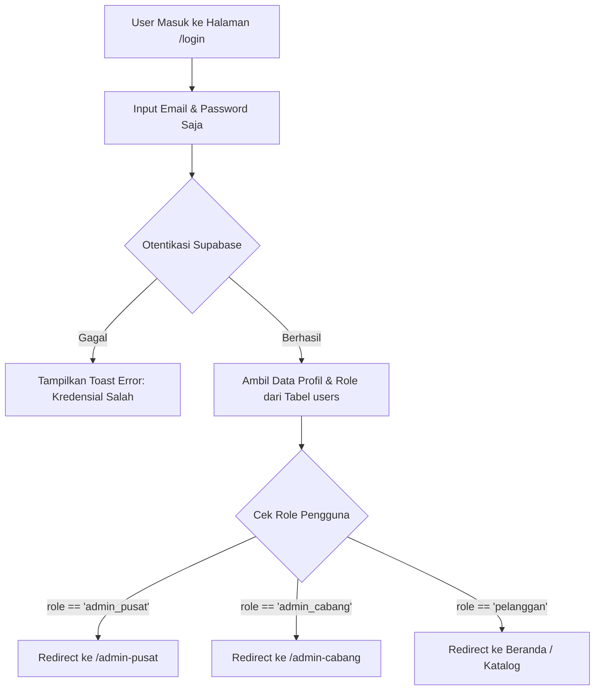
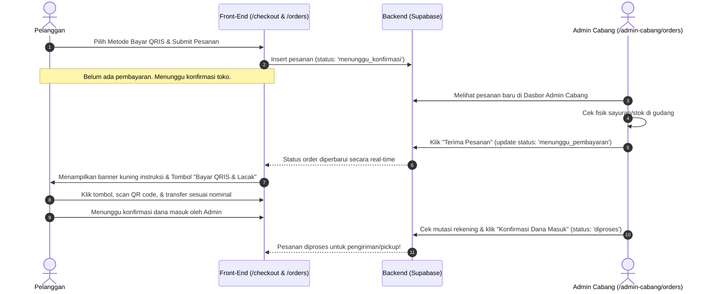

# PRODUCT REQUIREMENT DOCUMENT (PRD) & REFACTORING PLAN
**Nama Produk:** Hasil Bumi - Platform Digitalisasi Pemasaran & Manajemen Stok Pertanian Multi-Cabang  
**Versi Dokumen:** 2.1.0 (Advanced Geocoding, QRIS Workflow & UX Reliability Edition)  
**Target Rilis:** Production & Public Portfolio Ready  
**Tanggal Update Terakhir:** 28 Juli 2026  

---

## 1. PENDAHULUAN & VISI PRODUK

### 1.1 Latar Belakang
"Hasil Bumi" adalah platform e-commerce modern berbasis web yang dirancang untuk mendigitalisasi rantai pasok dan pemasaran produk pertanian segar, peternakan, serta kebutuhan dapur. Tantangan utama dalam bisnis pangan segar adalah manajemen **stok multi-cabang**, pemantauan masa simpan produk cepat rusak (**Perishable Goods**), serta kepastian ketersediaan stok sebelum proses transaksi pembayaran berlangsung.

### 1.2 Visi & Tujuan
1. **Bagi Pelanggan:** Memberikan kemudahan berbelanja sayur dan bahan pangan segar dengan opsi pengiriman lokal (*Local Delivery* berbasis kalkulasi GPS otomatis) maupun pengambilan langsung di toko fisik terdekat (*Pickup in Store*) tanpa biaya tambahan, serta alur pembayaran yang transparan dan aman.
2. **Bagi Admin Cabang:** Menyediakan alat kerja yang efisien untuk memantau stok cabang, memproses verifikasi pesanan masuk sebelum pembayaran, dan mendapat peringatan dini (*alert system*) untuk produk yang mendekati masa kedaluwarsa.
3. **Bagi Admin Pusat (Super Admin):** Memegang kendali penuh atas manajemen inventori global, analisis performa antar cabang, master data SKU, dan otorisasi pengguna.

---

## 2. ANALISIS MASALAH ALUR SAAT INI & SOLUSI TERBAIK (BEST PRACTICES)

Dalam evolusi sistem Hasil Bumi menuju versi 2.1.0, beberapa **celah keamanan (security flaw)**, alur transaksi pembayaran, dan penanganan UX yang kurang tepat telah diidentifikasi dan diperbarui dengan solusi standar industri e-commerce modern:

| No | Modul / Bagian | Kondisi Sebelumnya (Legacy Flow) | Masalah / Celah Risiko | Solusi Terbaik & Alur Baru (Best Practice) | Status |
|---|---|---|---|---|---|
| **1** | **Registrasi Publik (`/register`)** | Terdapat dropdown pilihan *"Daftar Sebagai: Pelanggan / Admin Cabang / Admin Pusat"*. | **Sangat Berbahaya (Critical Security Flaw):** Siapapun di internet bisa mendaftar sebagai Admin dan memanipulasi data toko. | **Hapus pilihan Role di form pendaftaran publik.** Semua pendaftar lewat `/register` otomatis mendapat role `pelanggan`. | **SELESAI** |
| **2** | **Login Sistem (`/login`)** | Pengguna harus memilih dropdown *"Login Sebagai"* sebelum memasukkan email & password. | **Redundansi UX:** Membingungkan pengguna. Jika salah pilih role, login gagal meskipun kredensial benar. | **Hapus dropdown Role di halaman login.** Cukup input Email & Password. Sistem melakukan **Smart Redirect** berdasarkan database. | **SELESAI** |
| **3** | **Alur Pembayaran QRIS** | Pelanggan langsung membayar (scan QRIS) saat pesanan dibuat (*instant payment*). | **Risiko Refund Rumit:** Jika stok fisik di toko ternyata rusak/habis atau toko tutup, admin kerepotan melakukan pengembalian dana (refund) manual ke rekening pembeli. | **Alur Konfirmasi Dulu, Bayar Kemudian:** Pesanan QRIS masuk dengan status `menunggu_konfirmasi`. Toko memeriksa stok terlebih dahulu. Setelah toko menyetujui pesanan, status berubah menjadi `menunggu_pembayaran` dan pelanggan baru diminta transfer QRIS. | **SELESAI** |
| **4** | **Kalkulasi Ongkos Kirim** | Ongkos kirim bersifat statis atau manual, tidak akurat berdasarkan lokasi nyata. | **Ketidakadilan Tarif:** Pelanggan yang lokasinya sangat dekat dengan toko membayar ongkos kirim yang sama dengan yang jauh. | **Smart Geocoding Otomatis (Nominatim API):** Sistem membaca alamat penerima dan menghitung jarak ke toko secara otomatis. **Gratis (Rp 0)** untuk jarak di bawah 1 KM, dan **Rp 3.000 / KM** untuk jarak di atas 1 KM. | **SELESAI** |
| **5** | **Penanganan Error UI (`ErrorBoundary`)** | Kegagalan pemuatan data atau error runtime memicu layar merah standar (*default fallback*) dari React Router. | **UX Kurang Profesional:** Menampilkan pesan error teknis bergaya bahasa pemrograman yang menakutkan pelanggan awam. | **Custom Error Boundary Bertema Brand:** Halaman penahan error khusus dengan nuansa hijau Hasil Bumi, pesan ramah bahasa Indonesia, tombol navigasi cepat (Muat Ulang, Kembali, Beranda), dan akordeon detail teknis tersembunyi untuk developer. | **SELESAI** |
| **6** | **Rute Legacy (`/admin`)** | Pada `routes.tsx`, rute `/admin` dikonfigurasi salah sasaran. | Sisa kode lama sebelum arsitektur Multi-Cabang dibuat. | **Hapus atau Redirect rute `/admin`.** Semua rute admin dipusatkan pada `/admin-cabang/*` dan `/admin-pusat/*`. | **SELESAI** |

---

## 3. ALUR OTENTIKASI & TRANSAKSI YANG DIPERBAIKI (NEW WORKFLOW)

### 3.1 Diagram Alur Login & Smart Redirect (All Roles)

### 3.2 Diagram Alur Pesanan QRIS Bertahap (Zero Refund Risk)

---

## 4. MATRIKS HAK AKSES PENGGUNA (RBAC - ROLE BASED ACCESS CONTROL)

| Fitur / Modul | Pelanggan (`pelanggan`) | Admin Cabang (`admin_cabang`) | Admin Pusat (`admin_pusat`) |
|---|:---:|:---:|:---:|
| **Melihat Katalog & Detail Produk** | Ya | Ya | Ya |
| **Membuat Pesanan (Checkout / Cart)** | Ya | Tidak | Tidak |
| **Melacak Status Pesanan Sendiri** | Ya | Tidak | Tidak |
| **Kelola Stok & Inventori Cabang Sendiri** | Tidak | Ya | Ya |
| **Kelola Stok & Inventori Cabang Lain** | Tidak | Tidak | Ya |
| **Proses & Verifikasi Pesanan Masuk** | Tidak (Hanya Batal sebelum diproses) | Ya (Hanya cabang tugasnya) | Ya (Semua cabang) |
| **Konfirmasi Pembayaran QRIS / COD** | Tidak | Ya | Ya |
| **Tambah / Edit Master Produk & SKU** | Tidak | Tidak | Ya |
| **Tambah & Kelola Data Cabang Fisik** | Tidak | Tidak | Ya |
| **Manajemen Akun Admin & Karyawan** | Tidak | Tidak | Ya |
| **Laporan Analitik & Keuangan Global** | Tidak | Tidak (Hanya rekap cabangnya) | Ya |

---

## 5. SPESIFIKASI FITUR UTAMA PER MODUL

### 5.1 Modul Pelanggan (Customer Experience)
- **Multi-Branch Selection:** Pelanggan dapat memilih cabang toko fisik yang ingin dituju (Jakarta Pusat, Jakarta Selatan, atau Tangerang).
- **Katalog Produk & Filter:** Menampilkan sayuran hijau, buah, daging, bumbu, dan peternakan dengan indikator stok real-time.
- **Smart Geocoding & Ongkos Kirim Dinamis:** Mendeteksi jarak lokasi pengiriman ke toko secara otomatis via integrasi API Nominatim. 
  - Jarak < 1 KM: Gratis Ongkos Kirim (Rp 0).
  - Jarak ≥ 1 KM: Tarif transparan Rp 3.000 per kilometer.
- **Pilihan Pengiriman Flexible:**
  - *Pickup in Store:* Ambil sendiri di toko fisik (Gratis ongkir, kode pengambilan).
  - *Local Delivery:* Pengantaran ke rumah berdasar kalkulasi jarak otomatis.
- **Alur Pembayaran Aman (Zero Refund Risk):** Dukungan COD dan QRIS dengan alur verifikasi pesanan terlebih dahulu sebelum transfer dana.
- **Order Tracking Interaktif:** Pelacakan status pesanan secara real-time dengan badge status berwarna standar dan riwayat detail item.
- **UX Reliability & Error Boundary:** Perlindungan kegagalan sistem dengan halaman error bertema hijau modern yang ramah pengguna.

### 5.2 Modul Admin Cabang (Branch Level Management)
- **Dashboard Operasional:** Ringkasan pesanan harian cabang, total stok kritis, dan daftar produk cepat rusak (*perishable alerts*).
- **Manajemen Pesanan Bertahap:** 
  - Memverifikasi kelayakan pesanan masuk sebelum pembayaran (konfirmasi order).
  - Memverifikasi penerimaan dana transfer QRIS maupun COD.
  - Memperbarui status pesanan: Menunggu Konfirmasi ➔ Menunggu Pembayaran ➔ Diproses ➔ Dikemas ➔ Dikirim/Siap Diambil ➔ Selesai.
- **Monitoring & Adjustment Stok:** Mengubah stok fisik toko, mengatur batas minimum, dan memonitor sisa masa simpan sayuran/daging.

### 5.3 Modul Admin Pusat (Super Admin & Executive)
- **Executive Dashboard:** Monitoring performa penjualan komparatif antar seluruh cabang secara langsung.
- **Master SKU & Katalog Global:** Pembuatan kode SKU standar (contoh: `VEG-TOM-001`), penentuan harga dasar, dan distribusi produk ke cabang-cabang.
- **Staff & User Authorization:** Manajemen akun kepala cabang dan penegakan keamanan sistem (pembaruan role tertutup).

---

## 6. STATUS PROGRESS & RENCANA KERJA (ACTION PLAN)

### Phase 1: Security & Auth Refactoring (Prioritas Tertinggi) — [SELESAI]
- [x] **Refactor `Register.tsx`**: Hapus dropdown pemilihan role, set default `role: 'pelanggan'`, dan wajibkan input alamat.
- [x] **Refactor `Login.tsx`**: Hapus dropdown pemilihan role, sederhanakan UI menjadi Email & Password dengan **Smart Redirect**.
- [x] **Refactor `AuthContext.tsx`**: Otentikasi murni membaca role dari database tanpa manipulasi front-end.
- [x] **Refactor Routing `routes.tsx`**: Bersihkan rute `/admin` yang redundan.

### Phase 2: Manajemen Pengguna & Admin Cabang — [SELESAI]
- [x] Buat halaman manajemen staf di Admin Pusat (`/admin-pusat/staff`).
- [x] Form penugasan cabang untuk akun Admin Cabang baru oleh Admin Pusat.
- [x] Fitur aktivasi dan penonaktifan akun karyawan.

### Phase 3: Alur Pembayaran QRIS & Geocoding Ongkir — [SELESAI]
- [x] **Geocoding Otomatis (Nominatim API)**: Penghitungan jarak real-time dari alamat pelanggan ke koordinat toko cabang.
- [x] **Logika Ongkos Kirim Dinamis**: Penerapan aturan gratis ongkir (< 1 KM) dan Rp 3.000/KM untuk jarak ≥ 1 KM.
- [x] **Alur QRIS Konfirmasi Bertahap**: Menghilangkan pembayaran instan di awal. Pesanan dikonfirmasi oleh admin terlebih dahulu, baru sistem memunculkan tagihan transfer dan kode QRIS.
- [x] **Refactor `Orders.tsx` & `OrderTracking.tsx`**: Penyesuaian UI/UX pelacakan untuk mendukung tahapan status baru (`menunggu_konfirmasi`, `menunggu_pembayaran`) secara responsif.

### Phase 4: UX Reliability & Database Query Hardening — [SELESAI]
- [x] **Halaman Error Boundary Khusus (`ErrorBoundary.tsx`)**: Menggantikan layar error merah standar React Router dengan halaman penahan bertema hijau yang ramah pelanggan, dilengkapi akordeon log teknis untuk developer.
- [x] **Hardening Query Supabase**: Menggunakan *wildcard select* (`*`) dan *relational join* pada modul pesanan untuk mencegah *schema cache error* jika struktur tabel berkembang.
- [x] **Fallback Perhitungan Total Harga**: Perlindungan kalkulasi total harga di sisi front-end (`item.total_harga || (item.qty * item.harga_saat_beli)`).

### Phase 5: Production Deployment & Security Auditing — [NEXT STEP]
- [ ] Verifikasi kebijakan Row Level Security (RLS) di dasbor Supabase untuk seluruh tabel operasional.
- [ ] Regenerate Supabase Database Password & Service Role Key untuk spesifikasi produksi.
- [ ] Pengujian beban kerja (*load testing*) dan pengecekan akhir sebelum rilis publik.

---

## 7. KESIMPULAN
Dengan rampungnya refactoring versi 2.1.0 ini, platform **Hasil Bumi** tidak hanya menghadirkan antarmuka bertema hijau yang bersih dan bebas emoji sesuai standar desain modern, tetapi juga telah memecahkan masalah nyata dalam operasi e-commerce bahan segar: **kemudahan pengantaran berbasis radius** serta **penghilangan risiko pengembalian dana (refund) melalui alur konfirmasi pesanan bertahap**. Arsitektur yang kokoh ini menjadikan Hasil Bumi siap rilis sebagai proyek portofolio bertaraf profesional.
